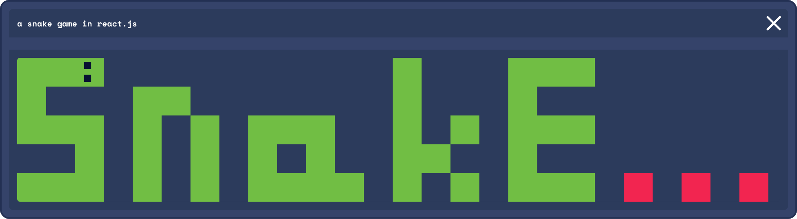

# 🐍 Snake...

**Snake...** est un projet étudiant de jeu Snake réalisé en React.js à partir d'une base créée en cours.

## 📋 Règles

Le jeu est découpé en **2 modes de jeu**.

### 🕹️ Mode classique
Ce mode correspond à la version classique de Snake. Le but du jeu est de récolter le plus de points en mangeant des pommes sans rentrer dans les murs ou percuter la queue de son serpent.

**Attention !** Des pièges sont présents et vous font perdre des points !

#### Fonctionnalités
- Musique et sons d'ambiance
- Possibilité de changer le skin de son serpent
- Possibilité d'enregistrer son score

### 🖌️ Mode chill
Dans ce mode, détendez-vous. Vous vous ennuyez et souhaitez faire passer le temps plus vite ? Jouez au mode ✨chill✨.

Ici, pas de possibilité de Game Over ou de points à collecter. Détendez-vous simplement en coloriant le plateau de jeu à votre guise, sous fond de musique lo-fi.

#### Fonctionnalités
- Musique d'ambiance
- Possibilité de changer de couleur
- Exporter votre création pour la montrer à vos amis

---

**Auteur :** 🧑‍🚀 [Robin Vigier](https://robinvigier.fr)  
**URL :** [à venir]

> ⚠️ L'interface utilisateur est provisoire et peut comporter des défauts.
